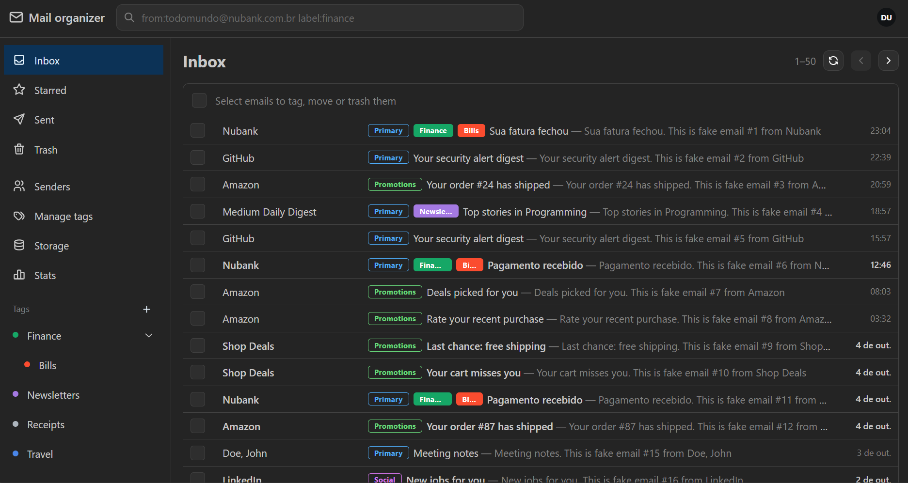
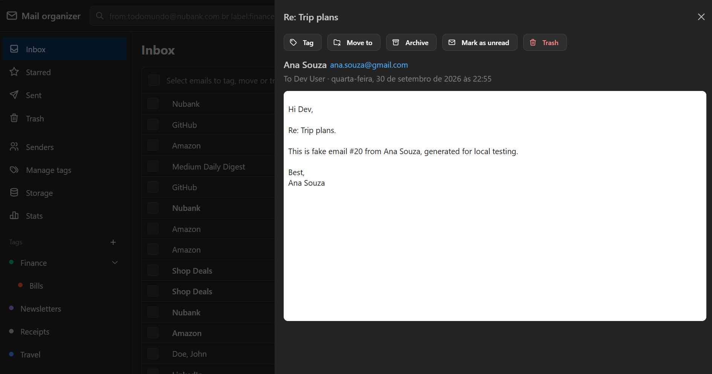
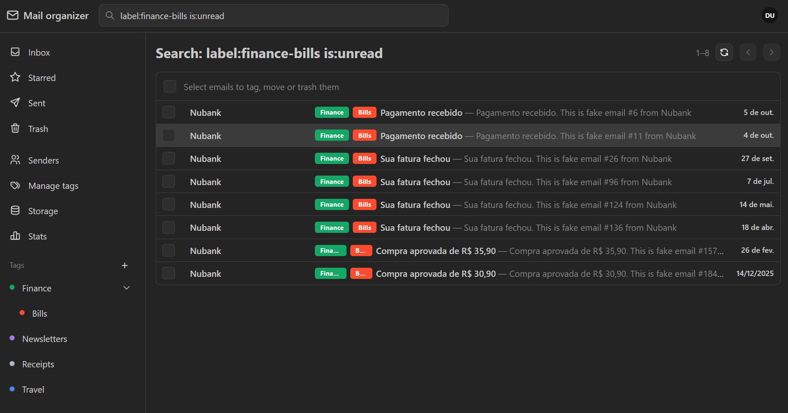
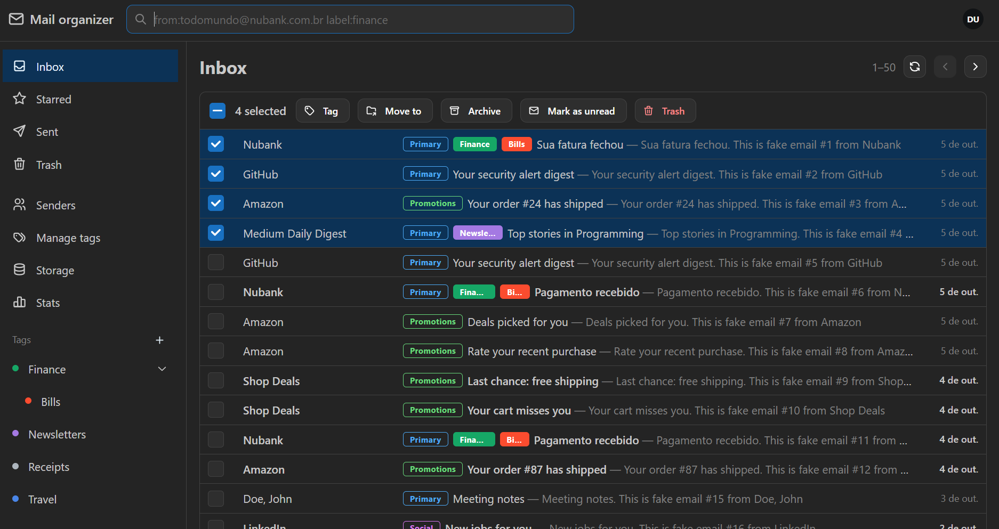
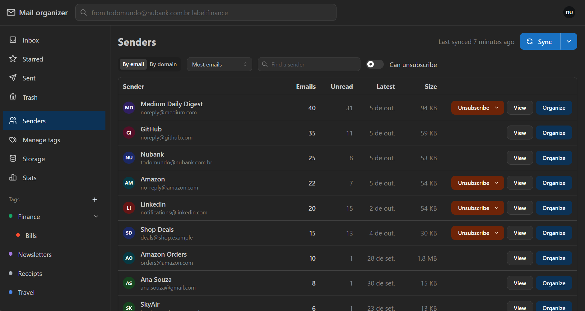
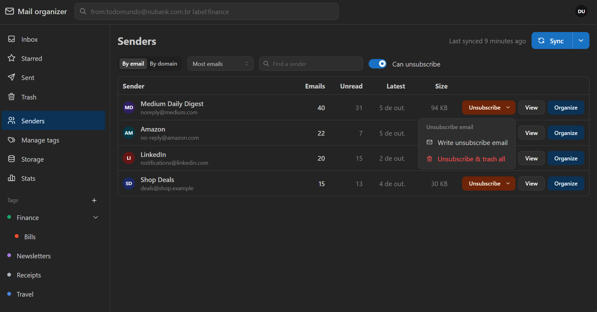
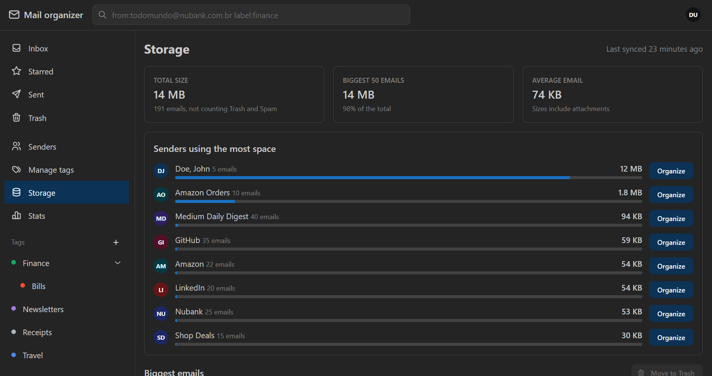
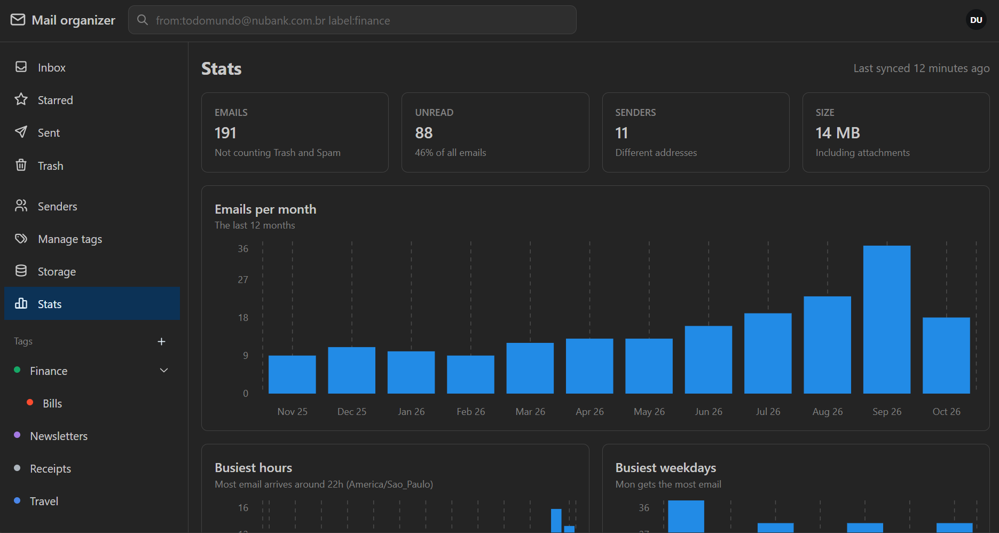
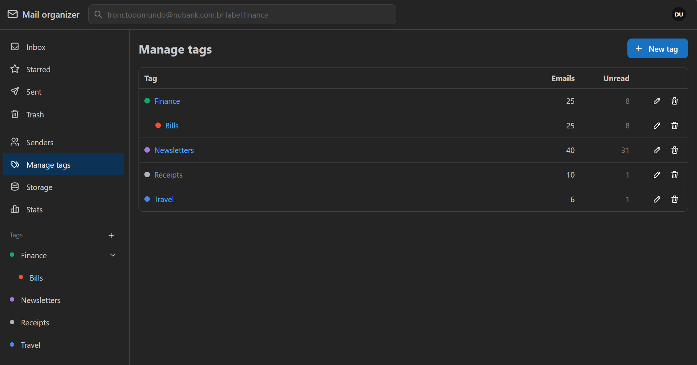
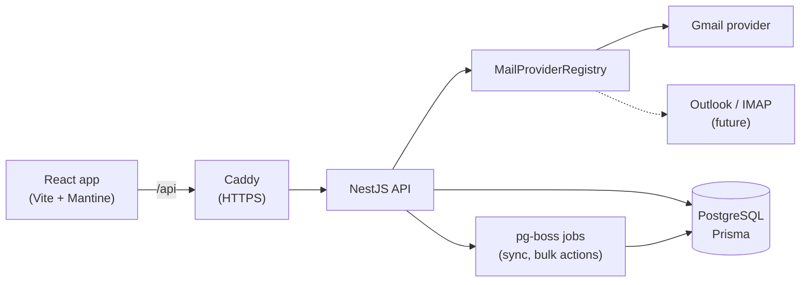

<div align="center">

# 📬 Mail Organizer

**Take back control of a messy Gmail inbox.**
Browse, search, tag, move and bulk-clean thousands of emails, see who fills your inbox,
unsubscribe in one click, and find out what's eating your storage.


<!--
  SCREENSHOT: hero.png
  Page:  /inbox  (http://localhost:5173/inbox)
  Shot:  the whole app window — sidebar with tags, search box, the mail list with
         category badges (Primary / Promotions / Social) and colored tag badges.
  Tip:   take it right after http://localhost:5173/api/auth/dev-login?reset=1
-->


</div>

---

## ✨ Highlights

- **Fast inbox browsing** — paginated mail list with Gmail categories, tags and unread state.
- **Powerful search** — `from:`, `to:`, `subject:`, `label:`, `is:unread`, `in:trash`… just like Gmail.
- **Bulk actions with Undo** — tag, move, archive, mark read or trash many emails at once.
- **Senders view** — group your mail by sender or domain and clean up a sender in one click.
- **Unsubscribe center** — find every sender that offers an unsubscribe link.
- **Storage hogs** — the senders and emails taking the most space.
- **Stats dashboard** — when you get email, from whom, and what kind.
- **Safe by design** — emails are never permanently deleted, only moved to Trash.
- **Provider-agnostic** — built so Outlook / IMAP can be added later without touching the UI or the database.

---

## 🖼️ Tour

### Inbox and email reading

<!--
  SCREENSHOT: email-view.png
  Page:  /inbox → click any email (e.g. one from ana.souza@gmail.com, "Trip plans")
  Shot:  the list on the left with the email drawer open on the right
         (actions bar, sender, tag badges, rendered body).
-->


Click an email to read it in a side drawer. HTML emails are rendered in a sandboxed frame
(scripts never run), and opening an unread email marks it as read.

### Search

<!--
  SCREENSHOT: search.png
  Page:  /search?q=label:finance-bills is:unread
         (type `label:finance-bills is:unread` in the header search box and press Enter)
  Shot:  title "Search: …" and the filtered list of Nubank emails.
-->


### Bulk actions with Undo

<!--
  SCREENSHOT: bulk-actions.png
  Page:  /inbox → tick 3–4 checkboxes
  Shot:  the "N selected" bar with Tag / Move / Archive / Mark read / Trash buttons.
         Bonus: click Trash and capture the notification with the Undo button
         (it disappears after 6 seconds — be quick, or press PrtScn).
-->


Every action can be undone from the notification that follows it.

### Senders — who fills your inbox

<!--
  SCREENSHOT: senders.png
  Page:  /senders (sidebar → Senders). Click "Sync" first if it says "Never synced".
  Shot:  the senders table (Emails, Unread, Latest, Size) with the "By email / By domain"
         toggle visible. Optional second shot: the "Organize" modal of a sender
         → save it as senders-organize.png.
-->


Group by sender or domain, sort by volume or size, and **Organize** a whole sender at once:
add a tag, archive, mark as read, or move everything to Trash.

### Unsubscribe center

<!--
  SCREENSHOT: unsubscribe.png
  Page:  /senders → turn on the "Can unsubscribe" switch
  Shot:  the 4 remaining senders with the Unsubscribe menu open on one of them
         ("Open unsubscribe link" / "Unsubscribe and trash all").
-->


### Storage hogs

<!--
  SCREENSHOT: storage.png
  Page:  /storage (sidebar → Storage). Needs a sync first.
  Shot:  the total size at the top, the "senders by size" list and the
         "biggest emails" table.
-->


### Stats dashboard

<!--
  SCREENSHOT: stats.png
  Page:  /stats (sidebar → Stats). Needs a sync first.
  Shot:  the 4 tiles (total, unread, senders, size) and the charts: by month, by hour,
         by weekday, categories, top senders. Take a full-page screenshot if it
         doesn't fit (Chrome DevTools → Ctrl+Shift+P → "Capture full size screenshot").
-->


### Manage tags

<!--
  SCREENSHOT: tags.png
  Page:  /tags (sidebar → Manage tags)
  Shot:  the tags table with nested sub-tags (Finance → Finance/Bills) and counts.
         Optional: click "New tag" and capture the form with the color swatches.
-->


---

## 🛡️ Design principles

| Principle | What it means |
|---|---|
| **Never lose email** | There is no "delete forever". Everything goes to Trash, with Undo. |
| **You control sync** | Mail metadata is copied only when you press **Sync** — no background jobs reading your inbox. |
| **Minimal data** | Only metadata is stored (sender, subject, snippet, size, labels). Full bodies are fetched on demand. OAuth tokens are encrypted at rest. |
| **Provider-agnostic** | Business code talks to a `MailProvider` interface; Gmail is just the first implementation. |

---

## 🏗️ Architecture



## Stack

| Layer | Tech |
|---|---|
| Frontend | React + TypeScript + Vite, Mantine, TanStack Query, React Router |
| Backend | NestJS (TypeScript), `googleapis` |
| Database | PostgreSQL + Prisma (no migrations — `prisma db push`) |
| Jobs | pg-boss (on PostgreSQL, no Redis) |
| Deploy | Docker Compose + Caddy (automatic HTTPS) on a VPS — manual deploy, no CI/CD |

## Project structure

```
.
├── docker-compose.yml        # production: postgres + backend + web (Caddy)
├── docker-compose.dev.yml    # local dev: only postgres (localhost:5433)
├── Caddyfile                 # serves the React app, proxies /api to the backend
├── .env.example              # copy to .env
├── backend/
│   ├── prisma/schema.prisma  # all tables live here (single source of truth)
│   ├── docker-entrypoint.sh  # runs `prisma db push`, then starts the API
│   └── src/
│       ├── config/           # env validation (zod)
│       ├── common/           # session guard, token encryption, validation
│       ├── jobs/             # pg-boss queues (sync, bulk actions)
│       ├── mail-providers/   # provider interface + gmail/ implementation
│       └── modules/          # auth, accounts, sync, messages, labels, senders
└── frontend/src/
    ├── api/                  # fetch client, React Query hooks, types
    ├── features/             # message actions, tags, senders dialogs
    ├── layouts/, components/
    └── pages/                # Login, Privacy, MailList, Senders, Tags, Storage, Stats
```

## Database without migrations

Tables are defined only in `backend/prisma/schema.prisma`. After changing it, run
`npm run db:push` (in Docker it runs on every start). If a change would lose data
(e.g. renaming or removing a field), it stops and explains instead of dropping anything.

---

## 🚀 Getting started

### 1. Google setup (once)

In [Google Cloud Console](https://console.cloud.google.com/):

1. **Create a project**, then **APIs & Services → Library → Gmail API → Enable**.
2. **Google Auth Platform → Branding**
   - App name **without** "Gmail" or "Google" (e.g. `Mail Organizer`), or creation fails.
   - Support email and developer contact email: your email.
   - **No logo** (it forces Google verification). Leave the other fields empty for now.
3. **Audience** → User type **External**, keep status **Testing**, and under
   **Test users** add your email (and your friends').
4. **Data Access** → nothing to add. The app requests the Gmail permissions itself at login.
5. **Clients → Create client → Web application**, redirect URI:
   `http://localhost:5173/api/auth/google/callback`
6. Copy the client ID and secret into `.env` (`GOOGLE_CLIENT_ID`, `GOOGLE_CLIENT_SECRET`).

In Testing mode Google asks you to log in again every 7 days. That goes away once the
app is published (see [Deploy](#3-deploy-on-the-vps)).

### 2. Local development

```bash
cp .env.example .env    # fill GOOGLE_* and TOKEN_ENCRYPTION_KEY (command in the file)
docker compose -f docker-compose.dev.yml up -d
cd backend && npm install && npm run db:push && npm run prisma:generate
cd ../frontend && npm install
cd .. && npm run hooks:install   # pre-commit: typecheck + lint + tests
```

Then, in two terminals from the project root:

```bash
npm --prefix backend run start:dev    # API on http://localhost:3000/api
npm --prefix frontend run dev         # site on http://localhost:5173
```

**Several checkouts at once** (git worktrees, e.g. parallel Claude sessions): start a slot
with `node scripts/dev.mjs backend 1` and `node scripts/dev.mjs frontend 1` (slot N = ports
3000/5173 + 100·N, its own database). Worktrees use the main checkout's environment file.

**Without Google (fake mailbox):** set `DEV_LOGIN=true` in `.env` and click **Dev login
(fake mailbox)** on the login page — ~200 generated emails, no Google account needed. Add
`?reset=1` (the button does) to start from a clean state. See `docs/feature-map.md`.

**First use:** open http://localhost:5173 → **Continue with Google** → on the
"unverified app" warning choose **Advanced → Go to app** → tick **both** Gmail
permissions. Then open **Senders → Sync** to copy your email metadata (needed for the
Senders, Storage and Stats views; click Sync again whenever you want fresh numbers).

### 3. Deploy on the VPS

Needs Docker, a domain (or a free DuckDNS subdomain) pointing at the VPS, and ports
80/443 open.

```bash
git clone <repo> && cd <repo>
cp .env.example .env    # set DOMAIN, a strong POSTGRES_PASSWORD, GOOGLE_*, TOKEN_ENCRYPTION_KEY
docker compose up -d --build
```

Then publish the Google app so logins stop expiring:

1. **Clients** → your client → add the redirect URI
   `https://<your-domain>/api/auth/google/callback`.
2. **Branding** → Home page `https://<your-domain>`, Privacy policy
   `https://<your-domain>/privacy`, Authorized domain `<your-domain>`.
   Both pages are served by this project (login page and `PrivacyPage.tsx`), no login needed.
3. **Audience → Publish app**. Ignore "verification required" — don't submit anything.

Update after changes:

```bash
git pull && docker compose up -d --build
```

Optional daily backup (cron on the VPS):

```bash
docker compose exec -T postgres pg_dump -U mail mail_organizer | gzip > backup-$(date +%F).sql.gz
```
